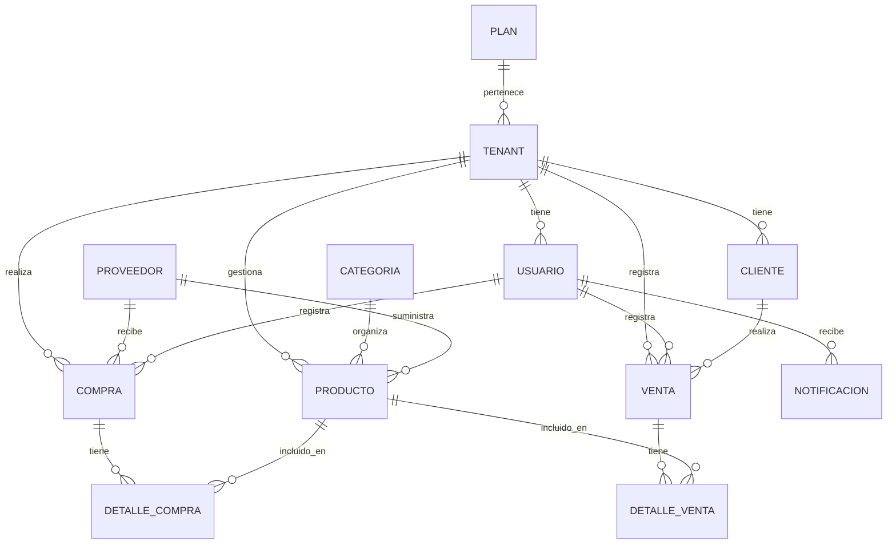

# MODELO ENTIDAD–RELACIÓN

## Sistema SaaS de Inventarios y Ventas para Microempresas (Freemium)

---

## 📊 Diagrama de Relaciones

---

## 📋 Definición de Entidades

### 1. ENTIDAD: TENANT (Microempresa)

Representa a cada microempresa registrada en el sistema (modelo SaaS).

- **Atributos:**
  - `tenant_id` (PK)
  - `nombre_empresa`
  - `telefono`
  - `email`
  - `direccion`
  - `moneda`
  - `impuesto_porcentaje`
  - `logo_url`
  - `horario_atencion`
  - `estado` (pendiente / activa / inactiva)
  - `fecha_registro`
  - `plan_id` (FK)

### 2. ENTIDAD: PLAN (Freemium / Básico / Premium)

Define las restricciones del sistema según la suscripción.

- **Atributos:**
  - `plan_id` (PK)
  - `nombre_plan` (Free, Básico, Premium)
  - `max_usuarios`
  - `max_productos`
  - `ventas_online` (boolean)
  - `reportes_avanzados` (boolean)
  - `precio`
  - `estado`
- **Reglas:**
  - Free / Básico: Sin ventas online.
  - Premium: Ventas online + QR + reportes avanzados.

### 3. ENTIDAD: USUARIO

Usuarios internos del tenant.

- **Atributos:**
  - `usuario_id` (PK)
  - `tenant_id` (FK)
  - `nombre`, `paterno`, `materno`
  - `email`
  - `password_hash`
  - `rol` (ADMIN, PROPIETARIO, VENDEDOR)
  - `estado` (activo/inactivo)
  - `fecha_creacion`
- **Reglas:**
  - PROPIETARIO: Dueño del tenant.
  - VENDEDOR: Solo puede vender y comprar.

### 4. ENTIDAD: CLIENTE

Clientes finales que compran productos.

- **Atributos:**
  - `cliente_id` (PK)
  - `tenant_id` (FK)
  - `nombre`, `paterno`, `materno`
  - `email`, `telefono`
  - `password_hash` (solo si tiene cuenta)
  - `fecha_registro`, `estado`
- **Reglas:**
  - Para usar carrito → debe tener cuenta.
  - Puede ver historial, comprobantes y estado de entrega.

### 5. ENTIDAD: CATEGORIA

Organiza los productos.

- **Atributos:** `categoria_id` (PK), `nombre`, `estado`.

### 6. ENTIDAD: PRODUCTO

Productos simples.

- **Atributos:**
  - `producto_id` (PK)
  - `tenant_id` (FK), `categoria_id` (FK), `proveedor_id` (FK)
  - `nombre`, `descripcion`, `precio`
  - `stock_actual`, `stock_minimo`, `estado`
- **Reglas:**
  - ❌ No se permite stock negativo.
  - ✔ Alerta si stock <= stock mínimo.

### 7. ENTIDAD: PROVEEDOR

Empresas que suministran productos.

- **Atributos:** `proveedor_id` (PK), `nombre`, `telefono`, `email`, `datos_pago`, `estado`.

### 8. ENTIDAD: COMPRA

Ingresos de productos al inventario.

- **Atributos:** `compra_id` (PK), `proveedor_id` (FK), `usuario_id` (FK), `fecha_compra`, `total`, `estado` (PENDIENTE / CONFIRMADA / CANCELADA).
- **Acción:** Actualiza automáticamente el Stock.

### 9. ENTIDAD: DETALLE_COMPRA

- **Atributos:** `detalle_compra_id` (PK), `compra_id` (FK), `producto_id` (FK), `cantidad`, `precio_unitario`, `subtotal`.

### 10. ENTIDAD: VENTA

Registro de ventas físicas u online.

- **Atributos:**
  - `venta_id` (PK)
  - `cliente_id` (FK, nullable), `usuario_id` (FK)
  - `fecha_venta`, `total`
  - `tipo_venta` (FISICA / ONLINE)
  - `metodo_pago` (EFECTIVO / QR / TRANSFERENCIA)
  - `estado_entrega` (PENDIENTE / EN_CAMINO / ENTREGADO)
  - `qr_pago` (nullable), `comprobante_pdf` (nullable)
  - `estado` (REGISTRADA / PAGADA / CANCELADA)
- **Acción:** Descuenta automáticamente el Stock.
- **Reglas:** Venta online solo para Premium. Pago QR automático.

### 11. ENTIDAD: DETALLE_VENTA

- **Atributos:** `detalle_venta_id` (PK), `venta_id` (FK), `producto_id` (FK), `cantidad`, `precio_unitario`, `subtotal`.

### 12. ENTIDAD: NOTIFICACION

- **Atributos:** `notificacion_id` (PK), `usuario_id` (FK), `tipo`, `mensaje`, `fecha_envio`.

### 13. REPORTE (LÓGICA)

Entidad lógica para análisis de datos.

- **Tipos:** Ventas por fecha, Inventario, Financiero, Por usuario/vendedor.
- **Características:** Visual en pantalla, Exportable PDF / Excel.
